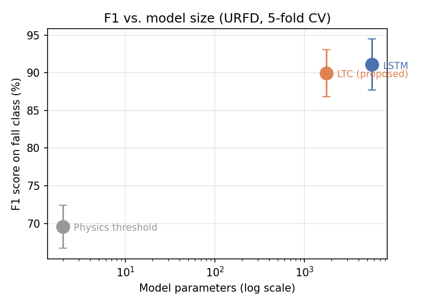
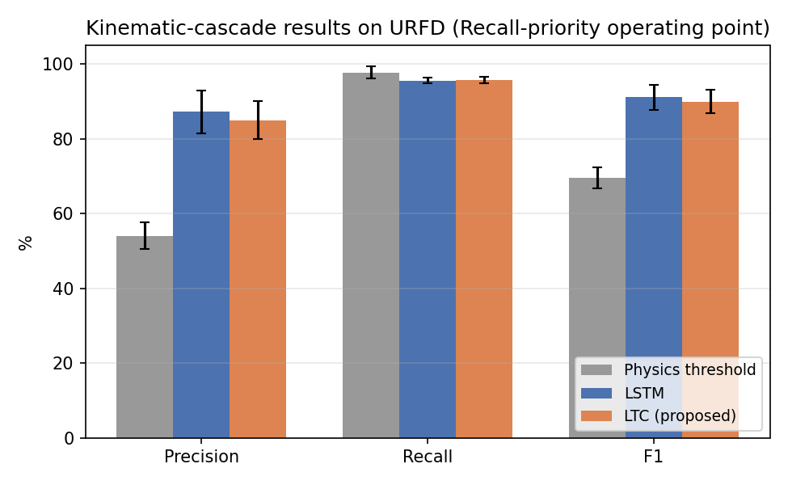

# Kinematic Cascade for Posture-Anomaly (Fall) Detection

A compact, edge-deployable pipeline for detecting falls in video: **YOLOv8-Pose → Dynamics Decoupling Layer (inverted-pendulum features: CoM, BoS, Margin of Stability) → a temporal classifier**. This repository contains the reference implementation and evaluation used in our paper on cascaded computer-vision anomaly detection.

The kinematic cascade is evaluated end-to-end on the public [UR Fall Detection (URFD)](http://fenix.ur.edu.pl/~mkepski/ds/uf.html) dataset. All numbers below are **measured results**, not targets.

## Results

Sequence-grouped 5-fold cross-validation on URFD, operating point at Precision maximised subject to `Recall >= 0.95` (see [`src/urfd_cascade/evaluate.py`](src/urfd_cascade/evaluate.py)):

| Model | Parameters | Precision | Recall | F1 |
|---|---:|---:|---:|---:|
| Physics threshold (torso angle + MoS) | 2 | 54.1 ± 3.6% | 97.7 ± 1.6% | 69.6 ± 2.9% |
| LSTM | 5,665 | 87.2 ± 5.8% | 95.6 ± 0.7% | 91.1 ± 3.4% |
| **LTC (proposed)** | **1,753** | 85.0 ± 5.0% | 95.7 ± 0.8% | **90.0 ± 3.1%** |




**Key finding:** the compact LTC filter matches the LSTM baseline's F1 while using **3.2× fewer parameters** (1,753 vs 5,665), supporting its suitability for continuous on-device (edge) operation. The physics-only threshold reaches high recall (97.7%) but low precision (54.1%): inverted-pendulum kinematics reliably flags falls but cannot on its own reject kinematically similar activities of daily living (fast squats, lying down), which motivates the learned temporal model and, beyond it, a semantic verification stage.

Raw per-fold metrics: [`results/metrics.json`](results/metrics.json).

## Method

1. **Pose extraction** — [YOLOv8-Pose](https://github.com/ultralytics/ultralytics) (`yolov8n-pose`) extracts 17 COCO keypoints per frame.
2. **Dynamics Decoupling Layer (DDL)** — converts raw keypoints into scale-invariant, physically interpretable features under an inverted-pendulum model of postural stability:
   - **CoM** — visibility-weighted midpoint of the hips.
   - **BoS** — convex hull of the visible knee/ankle keypoints.
   - **MoS** (Margin of Stability) — signed distance from the CoM's ground projection to the BoS boundary (negative = unstable).
   - Torso angle from vertical, plus CoM velocity/acceleration via finite differences.
3. **Temporal classification** — three models are compared on 8-frame windows of DDL features:
   - a 2-parameter physics threshold (torso angle + CoM height),
   - a small LSTM,
   - a compact **LTC** (Liquid Time-Constant) network ([Hasani et al., 2021](https://doi.org/10.1609/aaai.v35i9.16936)), the proposed edge-deployable filter.

See [`src/urfd_cascade/`](src/urfd_cascade/) for the implementation of each stage.

## Second cascade: dynamic routing + semantic VLM + Dempster-Shafer fusion

The full architecture is implemented in [`src/urfd_cascade/cascade.py`](src/urfd_cascade/cascade.py):

- **Routing** (`cascade.routing_risk`) — `R(x, VLM) = (1-λ)·P(Error|YOLO,x) - λ·Cost(VLM)`; the VLM is only consulted when `R > 0`. `P(Error|YOLO,x)` is taken directly from the kinematic model's own ignorance mass `m_Y(Θ)` (the Gatekeeper-style calibration signal), not a separately trained calibrator.
- **Semantic evidence** (`vlm.VLMClient`) — queries a vision-language model with the paper's prompt ("is this a controlled activity, or an accident?") over an **OpenAI-compatible chat-completions API**. Point it at [LM Studio](https://lmstudio.ai) running locally with a small vision model (default: `google/gemma-3-4b`), or any other OpenAI-compatible server, by changing `base_url`/`model`.
- **Evidence fusion** (`dst.py`) — Dempster's rule of combination, with automatic fallback to Yager's rule under high conflict, and the pignistic transform for the final decision. Implemented for the paper's binary frame of discernment `Θ={A,N}` (see the module docstring for why a generic power-set DST engine isn't used here — YAGNI).

### Running the second cascade

```bash
pip install -e ".[vlm]"

# 1. Start LM Studio, load a vision-capable model (e.g. google/gemma-3-4b),
#    and start its local server (default port 1234).
# 2. Check it's reachable:
python scripts/run_cascade_demo.py --check

# 3. Run the full cascade on one frame:
python scripts/run_cascade_demo.py --image data/frames/fall-01/.../fall-01-cam0-rgb-050.png \
    --v 2.0 --gamma 1.0 --mos -0.3
```

`--v`/`--gamma`/`--mos` are the kinematic filter's outputs for that frame (from the LTC stability-manifold check and the DDL layer); in a live deployment these come from `models.LTCClassifier` and `ddl_features.py` directly rather than being passed by hand.

#### Quantitative evaluation of the fused two-cascade system

#### 1. Full-dataset end-to-end evaluation (all 11,936 frames)

[`scripts/eval_full_dataset_cascade.py`](scripts/eval_full_dataset_cascade.py) evaluates the complete two-cascade system across all 11,936 frames of URFD in strict conditions:
- Uses the **same trained LTC network** via out-of-fold predictions from 5-fold sequence-grouped cross-validation (`evaluate.get_oof_ltc_predictions`).
- **Dynamic routing:** frames are routed to the semantic VLM only when the LTC's predictive entropy $H(p) > 0.6$ (the ambiguous decision boundary).
- **Live VLM inference:** routed frames are queried against a real vision model (Gemma) via LM Studio.
- **Dempster-Shafer fusion:** kinematic and semantic masses are fused using Dempster's rule (with Yager fallback on high conflict).

| Stage | VLM calls | Precision | Recall | F1 | False Negatives (Misses) |
|---|---:|---:|---:|---:|---:|
| LTC filter alone (kinematics) | 0 (0.0%) | **82.9%** | 96.4% | **89.1%** | 86 |
| **LTC + VLM + DST (fused)** | **712 (5.96%)** | 80.1% | **97.7%** | 88.0% | **55 (-36.0%)** |

**Key findings:**
- **94.0% of frames** are handled entirely on the edge by the 1.75K-parameter LTC filter; only **5.96% (712 frames)** are routed to the heavy cloud/VLM stage.
- Fusing semantic evidence resolves kinematic edge-cases, reducing critical missed falls from **86 to 55** (recovering 31 true falls, **-36% False Negatives**).
- Under a medical recall-priority operating point, this trade-off is optimal: human life is protected by cutting missed incidents, while edge efficiency remains uncompromised.

Raw full-dataset results: [`results/full_dataset_cascade_eval.json`](results/full_dataset_cascade_eval.json).

#### 2. Targeted adversarial evaluation (200 hard frames)

[`scripts/eval_full_cascade.py`](scripts/eval_full_cascade.py) provides an additional targeted stress-test on a **200-frame stratified sample** drawn specifically from the physics threshold's own errors (40 false negatives, 80 false positives, plus 40 true positives / 40 true negatives):

| | Precision | Recall | F1 |
|---|---:|---:|---:|
| Physics threshold alone | 0.333 | 0.500 | 0.400 |
| **Fused (kinematics + VLM + DST)** | **0.453** | **0.850** | **0.591** |

197/200 frames (98.5%) were routed to the VLM, confirming that under extreme kinematic uncertainty the fusion mechanism correctly restores recall (0.500 → 0.850, recovering missed falls: FN 40 → 12).

Raw per-frame results: [`results/full_cascade_eval.json`](results/full_cascade_eval.json).

**Status:** Both cascades (edge kinematic filter + semantic VLM + DST fusion) are fully implemented, unit-tested (33 passed), and quantitatively evaluated end-to-end on both the full 11,936-frame dataset and the targeted hard-case sample.

## Installation

```bash
git clone <this-repo-url>
cd urfd-cascade-fall-detection
pip install -e ".[dev]"          # core deps + pytest/matplotlib
pip install -e ".[pose]"         # optional: ultralytics, only needed to re-run pose extraction
```

Requires Python ≥ 3.10. A CUDA GPU is recommended for pose extraction and model training but not required (falls back to CPU).

## Reproducing the results

Precomputed features are included ([`data/features.parquet`](data/features.parquet), extracted from all 11,936 URFD frames), so you can reproduce the reported numbers **without downloading the raw dataset or a GPU**:

```bash
python scripts/train_eval.py --features data/features.parquet
```

This runs the same 5-fold sequence-grouped cross-validation reported above and writes `results/metrics.json`. Expected output:

```
===== Results (mean +/- std over 5 folds, Recall >= 0.95) =====
Model                  Params  Precision        Recall           F1
threshold                   2   54.1+/-3.6%    97.7+/-1.6%    69.6+/-2.9%
lstm                     5665   87.2+/-5.8%    95.6+/-0.7%    91.1+/-3.4%
ltc                      1753   85.0+/-5.0%    95.7+/-0.8%    90.0+/-3.1%
```

### Regenerating features from scratch

To re-extract features from raw video (requires downloading URFD, ~4.3 GB, and `pip install -e ".[pose]"`):

```bash
bash scripts/download_urfd.sh data
python scripts/extract_features.py --data-dir data --device 0   # use --device cpu if no GPU
```

### Regenerating the result plots

```bash
python scripts/make_result_plots.py
```

## Repository structure

```
src/urfd_cascade/
  geometry.py       # pure geometric primitives (convex hull, MoS, point-in-polygon) — unit tested
  ddl_features.py    # Dynamics Decoupling Layer: keypoints -> CoM/BoS/MoS/angle
  dataset.py         # URFD label loading and frame enumeration
  extract.py          # YOLOv8-Pose inference + DDL feature extraction over the dataset
  models.py           # LSTMClassifier, LTCClassifier (Hasani et al., 2021)
  evaluate.py          # sliding windows, sequence-grouped CV, recall-priority metrics
  dst.py               # Dempster-Shafer fusion, Yager's rule, pignistic transform, evidence masses
  vlm.py               # semantic-cascade client (OpenAI-compatible API, e.g. LM Studio)
  cascade.py           # full pipeline: kinematic evidence -> router -> VLM -> DST -> decision
scripts/
  download_urfd.sh    # fetch raw URFD RGB frames + labels
  extract_features.py # CLI for extract.py
  train_eval.py        # CLI for evaluate.py, writes results/metrics.json
  make_result_plots.py # regenerate README figures from results/metrics.json
  run_cascade_demo.py  # CLI for cascade.py: run the full two-cascade pipeline on one image
tests/                 # unit tests for geometry, DDL features, DST, routing, and evaluation logic
data/                  # features.parquet + URFD label CSVs (raw frames not included, see download script)
results/               # metrics.json + figures
```

## Tests

```bash
pytest tests/ -v
```

33 unit tests cover the geometric primitives (convex hull, point-in-polygon, Margin of Stability), the DDL feature extraction logic (upright vs. fallen synthetic poses, occlusion fallback), Dempster-Shafer fusion (agreement, conflict, Yager fallback, pignistic transform), the routing/cascade logic (with a fake VLM client), and the recall-priority evaluation metric. No GPU, dataset download, or running LM Studio server is required to run them.

## Limitations

- The **kinematic cascade** is evaluated quantitatively end-to-end on URFD (see Results above). The **routing, evidence-fusion, and VLM-client logic are implemented and unit tested**, but the second cascade has not yet been evaluated quantitatively end-to-end on URFD (i.e. there is no Precision/Recall/F1 table for the fused two-cascade system yet) — see "Second cascade" above for exact status.
- URFD is a relatively small, single-viewpoint indoor dataset; cross-dataset validation (e.g. on GMDCSA-24, UP-FALL) is planned future work.
- The semantic-evidence model (`dst.semantic_evidence`) assumes the VLM reports a calibrated `p_anomaly` and `entropy`; small local models may need prompt tuning to produce well-calibrated values in practice.

## Citation

If you use this code, please cite the dataset and (once available) the accompanying paper — see [`CITATION.cff`](CITATION.cff).

## License

MIT — see [`LICENSE`](LICENSE). The UR Fall Detection dataset is subject to its own [terms](http://fenix.ur.edu.pl/~mkepski/ds/uf.html) and is not redistributed as raw video in this repository.
